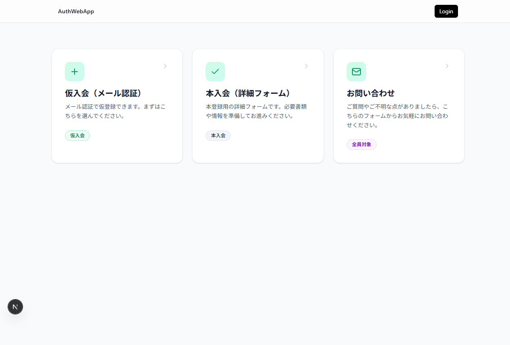
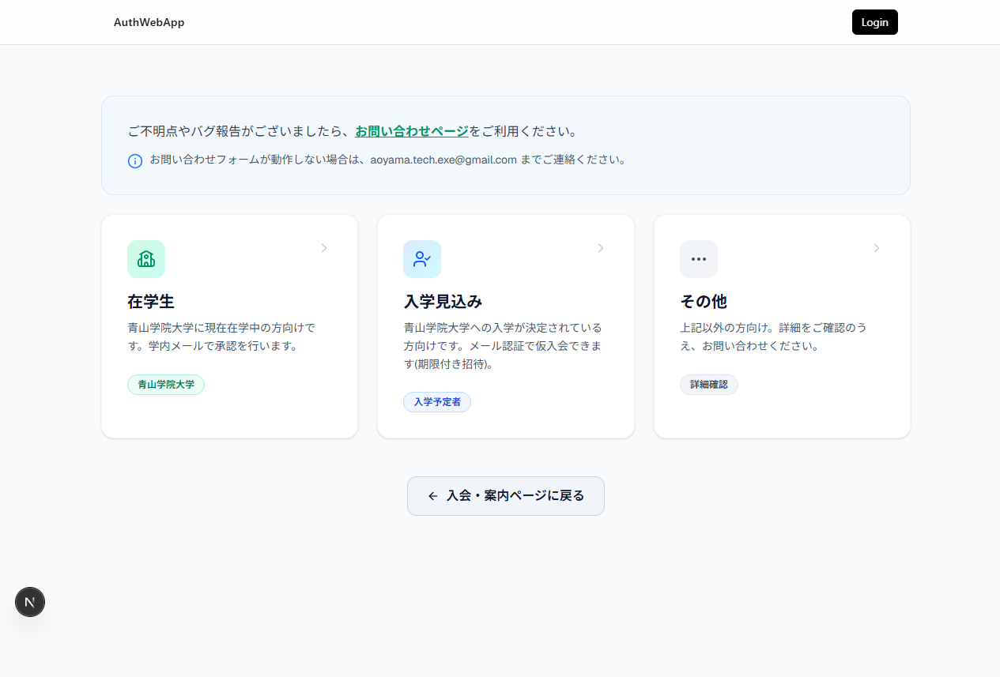
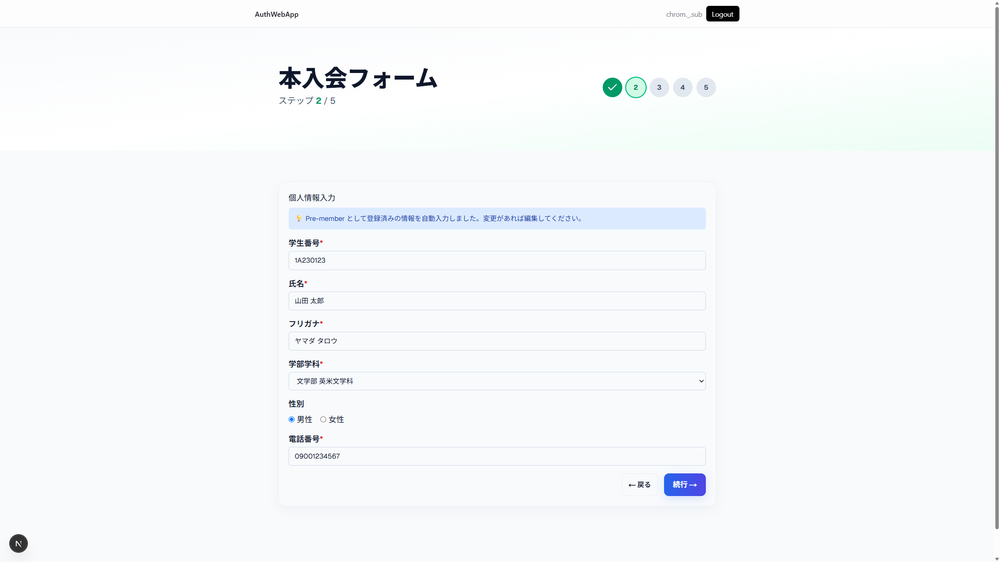

# 入会手続きガイド

**対象読者:** サークルへの入会を希望する方  
**作成日:** 2026-08-21

---

## 目次

- [1. 入会の種類](#1-入会の種類)
- [2. 入会案内ページ（`/join`）](#2-入会案内ページjoin)
- [3. 仮入会の手順](#3-仮入会の手順)
  - [3-1. 在学生の場合](#3-1-在学生の場合)
  - [3-2. 入学見込みの場合](#3-2-入学見込みの場合)
  - [3-3. その他の場合](#3-3-その他の場合)
- [4. 本入会の手順](#4-本入会の手順)
  - [ステップ1: 入会資格確認](#ステップ1-入会資格確認)
  - [ステップ2: 個人情報入力](#ステップ2-個人情報入力)
  - [ステップ3: アンケート](#ステップ3-アンケート)
  - [ステップ4: メール認証（OTP）](#ステップ4-メール認証otp)
  - [ステップ5: 登録完了](#ステップ5-登録完了)
- [5. よくあるエラーと対処法](#5-よくあるエラーと対処法)

---

## 1. 入会の種類

Digitart テクノロジー愛好会への入会には **仮入会** と **本入会** の2種類があります。

| 種類 | 概要 | ログイン |
|------|------|:--------:|
| **仮入会** | メール認証で仮登録。まずはこちらから。 | 不要 |
| **本入会** | 入会費支払い後、詳細情報を登録して本会員になる。 | 必要 |

---

## 2. 入会案内ページ（`/join`）

入会案内ページにアクセスすると、以下のカードが表示されます。

| カード | 説明 |
|--------|------|
| **仮入会（メール認証）** | 仮入会フォームへのリンク。初めての方はこちら。 |
| **本入会（詳細フォーム）** | 本入会フォームへのリンク。入会費支払い済みの方向け。 |
| **お問い合わせ** | 質問や不明点がある場合のお問い合わせフォームへのリンク。 |

---

## 3. 仮入会の手順

仮入会フォーム（`/join/form`）にアクセスすると、所属に応じた3つの選択肢が表示されます。

### 3-1. 在学生の場合

**対象:** 青山学院大学に現在在学中の方

1. 入会案内ページで **「仮入会（メール認証）」** をクリックします。
2. 仮入会フォームページで **「在学生」** カードをクリックします。
3. 表示されるフォームに従い、必要情報を入力します。
4. 青山学院大学の学内メールアドレスで承認が行われます。

### 3-2. 入学見込みの場合

**対象:** 青山学院大学への入学が決定されている方

1. 入会案内ページで **「仮入会（メール認証）」** をクリックします。
2. 仮入会フォームページで **「入学見込み」** カードをクリックします。
3. メール認証で仮入会します（期限付き招待）。

### 3-3. その他の場合

**対象:** 上記以外の方

1. 仮入会フォームページで **「その他」** カードをクリックします。
2. 詳細を確認し、必要に応じて **[お問い合わせフォーム](https://auth.digitart.jp/contact)** からご連絡ください。

---

## 4. 本入会の手順

**前提条件:**
- Discord アカウントでログイン済みであること
- 仮入会（pre-member 登録）が完了していること
- 入会費の支払いが完了していること（管理者による確認済み）

本入会フォーム（`/join/member`）にアクセスすると、5つのステップで本会員登録を進めます。画面右上にプログレスバーが表示され、現在のステップを確認できます。

### ステップ1: 入会資格確認

システムが自動的に以下の3つの条件を確認します。

| 確認項目 | 意味 |
|----------|------|
| **Discord ログイン** | Discord アカウントでログインしているか |
| **Pre-member 登録** | 仮入会が完了しているか |
| **支払済み確認** | 入会費が清算されているか |

- すべて **✓ 確認済み** になっている場合、**「続行 →」ボタン** をクリックして次のステップに進みます。
- 条件を満たしていない場合は、画面に理由と対処方法が表示されます。

> **入会予定者リストに登録されていないと表示される場合:**
> - 初めての方 → まず [仮入会フォーム](https://auth.digitart.jp/join/form) からお申し込みください。
> - 入会費をお支払い済みの場合 → [お問い合わせフォーム](https://auth.digitart.jp/contact) で幹部会にご連絡ください。

### ステップ2: 個人情報入力

以下の情報を入力します。

| 項目 | 必須 | 説明 |
|------|:----:|------|
| **学生番号** | ✓ | 青山学院大学の学生番号 |
| **氏名** | ✓ | 「姓 名」の形式（半角スペース区切り） |
| **フリガナ** | ✓ | 氏名のフリガナ |
| **学部・学科** | ✓ | 所属学部・学科を選択 |
| **性別** | — | 任意 |
| **電話番号** | ✓ | 連絡先の電話番号 |

- 仮入会時に登録済みの情報がある場合は、自動入力されます（「Pre-member として登録済みの情報を自動入力しました」と表示されます）。
- 内容を確認・修正し、**「続行 →」ボタン** をクリックします。

### ステップ3: アンケート

サークル運営のための任意のアンケートに回答します。

| 質問 | 回答形式 |
|------|----------|
| 1. Digitartの認知経路 | 複数選択 |
| 2. サークルの認知経路 | 複数選択 |
| 3. Discordへの参加経路 | 単一選択 |
| 4. 希望する活動分野 | 複数選択 |
| 5. 活動目的 | 複数選択 |

- 「その他」を選択した場合は、テキスト入力欄に詳細を記入してください（必須）。
- 回答後、**「次へ」ボタン** をクリックします。

### ステップ4: メール認証（OTP）

青山学院大学のメールアドレスを使った本人確認を行います。

1. **「確認コードを送信」ボタン** をクリックします。
2. 学生番号に紐づくメールアドレスに、**6桁の確認コード** が送信されます。
3. 受信した6桁のコードを入力欄に入力します。
4. **「認証 →」ボタン** をクリックします。

| 項目 | 説明 |
|------|------|
| **有効期限** | 確認コードの有効期限は **10分間** です |
| **再送信** | 確認コードが届かない場合、60秒後に **「コードを再送信」** ボタンが有効になります |

### ステップ5: 登録完了

「✅ 入会登録完了！」と表示されれば、本会員としての登録が完了です。

- 登録情報（学生番号・名前）が画面に表示されます。
- **「お問い合わせ」ボタン** をクリックすると、お問い合わせフォームに移動できます。

---

## 5. よくあるエラーと対処法

| エラー | 対処方法 |
|--------|---------|
| 「Not authenticated」で自動的にログインページに遷移する | Discord アカウントで再度ログインしてください。 |
| 入会資格確認で「✗ 未リンク」 | Discord アカウントでログインし直してください。 |
| 入会資格確認で「✗ 未登録」 | まず仮入会フォーム（`/join/form`）から仮入会してください。 |
| 入会資格確認で「✗ 未確認」 | 入会費の支払いが未確認です。入会費を支払い後、管理者に確認をお願いしてください。 |
| OTP送信に失敗 | ネットワーク接続を確認し、再度お試しください。 |
| OTP認証に失敗 | コードの入力が正しいか確認してください。有効期限（10分）が切れている場合は再送信してください。 |
