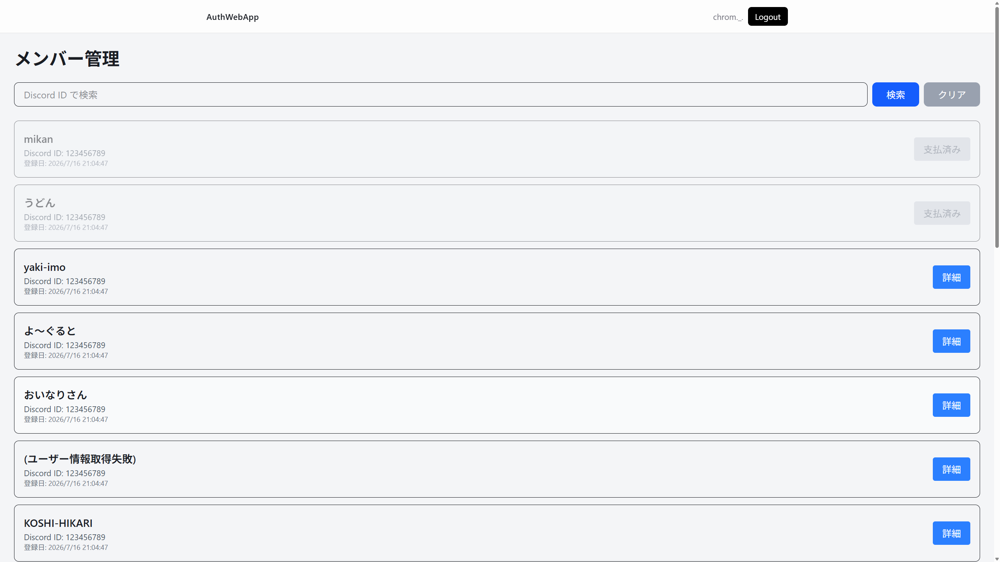

# メンバー管理（管理者向け）

**対象ページ:** `/members`  
**対象読者:** admin（管理者）のみ  
**作成日:** 2026-08-21

---

## 目次

- [1. メンバー管理ページについて](#1-メンバー管理ページについて)
- [2. 画面の見方](#2-画面の見方)
- [3. 入会予定者を検索する](#3-入会予定者を検索する)
- [4. 入会費清算を行う](#4-入会費清算を行う)
- [5. 注意事項](#5-注意事項)

---

## 1. メンバー管理ページについて

メンバー管理ページ（`/members`）は、**admin（管理者）** 専用のページです。

ここでは、**仮入会（pre-member）済みのメンバー** の一覧確認と、**入会費の清算処理** を行います。

---

## 2. 画面の見方

### メンバー情報の表示

| 項目 | 説明 |
|------|------|
| **Discordユーザー名** | Discord のユーザー名（表示名がある場合はカッコ内に表示） |
| **Discord ID** | Discord のユーザーID |
| **Supabase ID** | 認証システムのユーザーID（表示されない場合あり） |
| **User ID** | システム内部のユーザーID（表示されない場合あり） |
| **登録日** | Pre-member として登録された日時 |

### ボタンの状態

| ボタン | 説明 |
|--------|------|
| **「詳細」**（青色） | クリックすると入会費清算のモーダルが開きます |
| **「支払済み」**（グレー） | すでに入会費清算が完了しています。クリックできません |

---

## 3. 入会予定者を検索する

1. 画面上部の検索欄に **Discord ID** を入力します。
2. **「検索」ボタン** をクリックします。
3. 該当するメンバーが一覧に表示されます。

> **全件を再表示** するには **「クリア」ボタン** をクリックします。

---

## 4. 入会費清算を行う

入会費の支払いを確認し、システムに記録します。

### 手順

1. 対象メンバーの **「詳細」ボタン** をクリックします。
2. 確認モーダルが開きます。メンバーの情報（Discordユーザー名・Discord ID）を確認します。
3. 必要に応じて **「メモ」欄** に情報を記入します。
   - 例: 「現金で入会費支払い」「PayPayで入金確認済み」
4. **「入会費清算」ボタン**（黄色）をクリックします。
5. 「入会費清算を完了しました」と表示されれば成功です。
6. モーダルが自動的に閉じ、メンバーリストが更新されます。

> **キャンセル** する場合は **「キャンセル」ボタン** をクリックしてモーダルを閉じます。

### 清算後の状態

- 対象メンバーのボタンが **「支払済み」**（グレー）に変わります。
- 以後、そのメンバーの行はグレーアウトして表示されます。
- 清算済みのメンバーは、本入会フォームのステップ1（入会資格確認）で「支払済み確認: ✓ 確認済み」と表示されるようになります。

---

## 5. 注意事項

- 入会費清算は **取り消しができません**。実際に入会費の支払いを確認してから操作してください。
- 清算処理は、メンバーが本入会フォームに進むための前提条件となります。清算が未完了の場合、メンバーは本入会ステップ1で「✗ 未確認」と表示され、先に進めません。
