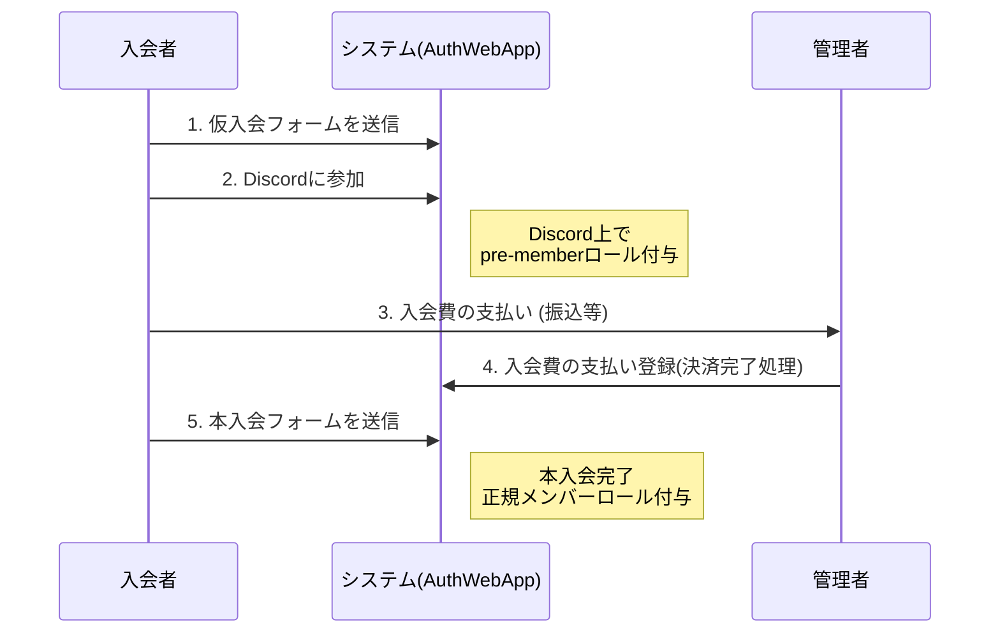

# 新規メンバー登録フロー（管理者向け）

本ドキュメントでは、新規ユーザーがメンバーになる（本入会する）までの全体フローについて説明します。

## フロー概要

新規ユーザーの入会手続きは、以下の5つのステップで進行し、すべて完了すると本入会（正規メンバー）となります。

1. **(入会者)** 仮入会フォームを送る
2. **(入会者)** Discordに参加する（**pre-memberになる**）
3. **(入会者)** 入会費の支払いをする
4. **(管理者)** 入会費の支払い登録をする
5. **(入会者)** 本入会フォームを送る

---

## 登録フロー図

## 各ステップの詳細解説

### 1. (入会者) 仮入会フォームを送る
入会希望者が、入会案内に従って「仮入会フォーム」に必要事項を入力し送信します。
この時点ではまだ正式なメンバーではありません。
> 関連マニュアル: [入会手続きガイド（仮入会）](join-guide.md#3-仮入会の手順)

### 2. (入会者) Discordに参加する (pre-memberになる)
フォーム送信後、指定されたリンクからコミュニティのDiscordサーバーに参加します。
参加が確認されると、一時的な権限である **pre-member** ロールが付与されます。
> 関連マニュアル: [ログイン・初期設定ガイド](getting-started.md)

### 3. (入会者) 入会費の支払いをする
入会者は、指定された方法（銀行振込・クレジットカード・手渡しなど）で入会費の支払いを行います。
> 関連マニュアル: [入会手続きガイド](join-guide.md)

### 4. (管理者) 入会費の支払い登録をする
管理者は入会費の支払いを着金確認等で確認でき次第、システム上で該当ユーザーの「支払い登録」を行います。
> [!IMPORTANT]
> 管理者によるこのステップが完了しないと、入会者は次の「本入会フォーム」へ進むことができません。支払いの確認が取れ次第、速やかに登録処理を行ってください。
> 
> 関連マニュアル: [メンバー管理（管理者向け）](members-admin.md#4-入会費清算を行う)

### 5. (入会者) 本入会フォームを送る
支払い登録が完了すると、入会者は「本入会フォーム」を送信できるようになります。
このフォームが送信されシステムに受理された時点で、登録フローは **完了** となり、入会者は正式なメンバーとなります。
> 関連マニュアル: [入会手続きガイド（本入会）](join-guide.md#4-本入会の手順)
