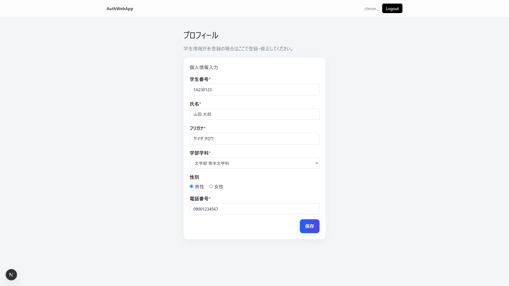

# プロフィール管理

**対象ページ:** `/profile`  
**対象読者:** member / admin / obog でログイン済みのユーザー  
**作成日:** 2026-08-21

---

## 目次

- [1. プロフィールページについて](#1-プロフィールページについて)
- [2. プロフィールを登録・編集する](#2-プロフィールを登録編集する)
- [3. 入力項目](#3-入力項目)
- [4. 注意事項](#4-注意事項)

---

## 1. プロフィールページについて

プロフィールページ（`/profile`）では、**学生情報の登録・編集** を行えます。

このページにアクセスできるのは、以下のいずれかの権限を持つログイン済みユーザーです：
- **member**（一般メンバー）
- **admin**（管理者）
- **obog**（卒業生）

権限が不足している場合は、自動的にログインページにリダイレクトされます。

---

## 2. プロフィールを登録・編集する

### 初回登録の場合

1. 画面に「学生情報が未登録の場合はここで登録・修正してください。」と表示されます。
2. 各項目を入力し、フォーム下部の **送信ボタン** をクリックします。

### 登録済み情報の編集

1. プロフィールページにアクセスすると、登録済みの情報が自動的にフォームに入力されます。
2. 変更したい項目を修正し、フォーム下部の **送信ボタン** をクリックします。

---

## 3. 入力項目

| 項目 | 必須 | 説明 |
|------|:----:|------|
| **学生番号** | ✓ | 青山学院大学の学生番号 |
| **氏名** | ✓ | 「姓 名」の形式で入力（姓と名の間に半角スペース） |
| **フリガナ** | ✓ | 氏名のフリガナ |
| **学部・学科** | ✓ | 所属学部・学科を選択 |
| **性別** | — | 任意 |
| **電話番号** | ✓ | 連絡先の電話番号 |

---

## 4. 注意事項

- プロフィール情報は **本入会フォーム**（`/join/member`）のステップ2で入力した情報と共通です。ここで変更した情報は、本入会フォームにも反映されます。
- 入力した情報はサークルの運営・管理のみに使用されます。
